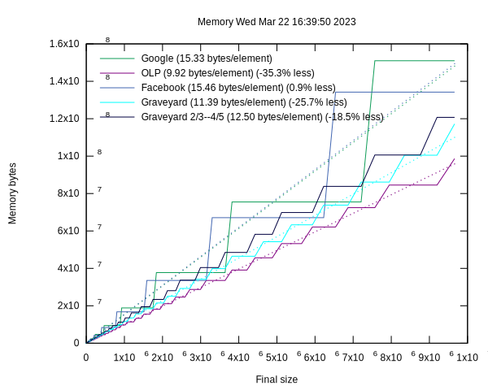

# Graveyard Hashing

This is an implementation of Graveyard Hashing.

Michael A. Bender, Bradley C. Kuszmaul, and William Kuszmaul.  "Linear Probing
Revisted: Tombstones Mark the Death of Primary Clustering".  July 2021, 2021
*IEEE 62nd Annual Symposium on Foundations of Computer Science (FOCS)*.

The big question is whether Graveyard hashing can compete with industrial-grade
hash tables such as Google's Abseil or Facebook's F14.

## Benchmarks for unordered set of `uint64_t`.

`OLP` is simple linear probing running at between $3/4$ and $7/8$ load
factor.  This table has no vector instructions.  It uses `UINT64_MAX` as a
not-present sentinal (and special cases the case of `UINT64_MAX` by storing a
bit in the header.

`Google` is `absl::flat_hash_set`.

`Facebook` is `folly::F14FastSet`.

`idhash` means to use the identity function as the hash.  The numbers are
already from `std::uniform_int_distribution`, so we shouldn't need to hash them
further.  But there are some strange results, so TODO: See if the absl random
number generators produce better graphs.

In these graphs, the shaded regions are the 95% confidence interval (two
standard deviations).

Insertions for `OLP` are the slowest, and `Facebook` is slow too.


Reserve closes the gap for `OLP`, showing that the performance difference is
caused by the OLP doing more rehashes.  The cost of the hash function shows up
here, where `Google` and `Google-idhash` have difference performance since the
the `idhash` code doesn't have to call the hash function. `Facebook` doesn't seem
to gain much from reserve.

`Facebook` has some weird jitter in the range of about 1.8e6 to 3.1e6.  It seems to
be repeatable.


Here we've vectorized the ``find` operation: `graveyard` and `Facebook` are fast
at successful find (probably because of a single cache miss in most cases).
Surprisingly the non-vectorized `OLP` is about the same speed as `Google`.  The
non-vectorized `graveyard` was slower, so the vectorization makes a difference.


For unsucessful find, here the `Google` organization seems to help.
 * `OLP` is slow (probably because it's not vectorized).
 * `Facebook` and `graveyard` are slower than `Google`, probably because they
    need one cache miss to process 14 elements, whereas `Google` can process an
    average of 32 elements in the first cache miss.


On average `OLP` saves about 36% memory.  The curve fit is a linear fit
minimizign the sum of the squares of the differences.  `Facebook` uses the same
amount of memory as `Google`: they are both restricted to powers of two.



To produce these plots:
```shell
$ bazel build -c opt hash_tables_benchmark
$ bazel-bin/hash_tables_benchmark 
$ gnuplot makeplots.gnuplot
```

To produce data for just graveyard:

```shell
$ bazel-bin/hash_tables_benchmark --implementations=graveyard,graveyard-idhash
```

To produce data with more points on the x axis:

```shell
$ bazel-bin/hash_tables_benchmark --size_growth=100
```

## Coding Style

Follow the Google style guide.

Keep code formatted with `clang-format`.  E.g.,
```shell
$ clang-format -i *.h *.cc
```

Keep includes clean with iwyu:

```shell
$ for x in *.h *.cc; do include-what-you-use -Xiwyu --no_fwd_decls -x c++ -std=c++17 -I/home/bradleybear/.cache/bazel/_bazel_bradleybear/06d43ecbdaa4800474a92f4f59e8b2b3/external/com_google_absl/ -I/home/bradleybear/github/folly $x; done
```

## TODO

- [x] Move implementation details into a separate file.  (2023-02-13)
- [x] Change from std::vector to a malloced, aligned memory allocation. (2023-02-13)
- [x] Change "Tombstone" to "Graveyard". (2023-02-13)
- [x] Vectorize `contains` (2023-02-13)
- [x] Change "tombstone" to "graveyard" in plots and the few other remaining places. (2023-02-14)
- [x] Vectorize the first part of `insert`.  (The case where we are inserting an item that's already present.) (2023-02-14)
- [x] Optimize the insert for the case where we know the key is not already present.  (2023-02-14)
- [x] Use the hash and equals functors.  (2023-02-14)
- [x] Does prefetching make any difference?  Maybe on insert. (2023-02-14)
- [x] Measure the difference in probe lengths when ordering is maintained:

      Conclusion: Ordering reduces the number of cache lines touched on unsuccessful queries.  Number of cache lines touched for each kind of query as per `bazel run -c opt probe_length_benchmark` on branch `main` vs. on branch `distance_in_slots_rather_than_buckets`:

         | Ordered? | Success | Unsuccess |
         |----------|---------|-----------|
         | Without  | 1.161   | 1.958     |
         | With     | 1.201   | 1.524     |

- [ ] Keep track of whether we must maintain reference stability.  If not, then inserts should reorder (which will make the unsuccessful-find faster).
- [ ] Does H2 computing %255 vs %128 make any difference?
- [ ] Vectorize other operations
- [ ] Why are the idhash versions slower (e.g., for OLP)  Is it a bad random number generator?
- [ ] Where is that jitter comming from  in facebook?
- [ ] Put as much metadata as possible into the malloced part (but not the
      `logical_bucket_count_` which is in the critical path for `find`.
- [ ] Increase the size of `buckets_` to match the actual allocated memory.
      This doesn't seem to make any difference for libc malloc, but it probably
      makes a difference for a bucketed malloc such as tcmalloc.
- [ ] Change the search_distance to the number of slots instead of the number of buckets.
- [ ] Implement stability
    *   Need a reservation_count to tell us whether the current insertion must maintain stability.
    *   Possibly specially handle the case where we do `reserve(size()+k)` for
        small `k`.  In this case we might maintain a set of `k` offsets to
        values that are out of place so that on the next insert or reserve we
        can go fix those particular ones up.
- [ ] Implement maps.  One issue is how to deal with the `value_type =
     std::pair<const key_type, mapped_type>`.  The F14 comment (F14Policy.h at
      `moveValue`. outlines three possibilities:

      1.   Proxy iterator
      2.   Pointless key copy when moving items during rehash
      3.   Undefined-behavior hack.

      F14 uses the undefined-behavior hack for maps. Abseil uses a
    
      Abseil does the pointless key copy unless `std::pair<key_type,
      mapped_type` is layout compatible to `std::pair<const key_type,
      mapped_type>` in which case it can use `std::move` on the key type.
      Question: What conditions is the pointless key copy actually happening?
      For example, does it use std::move when doing something like a
      `flat_hash_map<std::string, SomeMappedType>`?
- [ ] Implement prehash and a two-argument find for bulk lookup.
