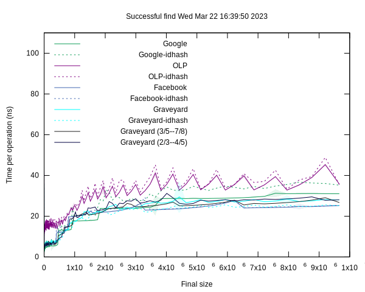

# Graveyard Hashing

This is an implementation of Graveyard Hashing.

Michael A. Bender, Bradley C. Kuszmaul, and William Kuszmaul.  "Linear Probing
Revisted: Tombstones Mark the Death of Primary Clustering".  July 2021, 2021
*IEEE 62nd Annual Symposium on Foundations of Computer Science (FOCS)*.

The big question is whether Graveyard hashing can compete with industrial-grade
hash tables such as Google's Abseil or Facebook's F14.

## Benchmarks for unordered set of `uint64_t`.

`OLP` is simple linear probing running at between $3/4$ and $7/8$ load
factor.  This table has no vector instructions.  It uses `UINT64_MAX` as a
not-present sentinal (and special cases the case of `UINT64_MAX` by storing a
bit in the header.

`Google` is `absl::flat_hash_set`.

`Facebook` is `folly::F14FastSet`.

`idhash` means to use the identity function as the hash.  The numbers are
already from `std::uniform_int_distribution`, so we shouldn't need to hash them
further.  But there are some strange results, so TODO: See if the absl random
number generators produce better graphs.

In these graphs, the shaded regions are the 95% confidence interval (two
standard deviations).

Insertions for `OLP` are the slowest, and `Facebook` is slow too.


Reserve closes the gap for `OLP`, showing that the performance difference is
caused by the OLP doing more rehashes.  The cost of the hash function shows up
here, where `Google` and `Google-idhash` have difference performance since the
the `idhash` code doesn't have to call the hash function. `Facebook` doesn't seem
to gain much from reserve.

`Facebook` has some weird jitter in the range of about 1.8e6 to 3.1e6.  It seems to
be repeatable.


Here we've vectorized the ``find` operation: `graveyard` and `Facebook` are fast
at successful find (probably because of a single cache miss in most cases).
Surprisingly the non-vectorized `OLP` is about the same speed as `Google`.  The
non-vectorized `graveyard` was slower, so the vectorization makes a difference.



For unsucessful find, here the `Google` organization seems to help.
 * `OLP` is slow (probably because it's not vectorized).
 * `Facebook` and `graveyard` are slower than `Google`, probably because they
    need one cache miss to process 14 elements, whereas `Google` can process an
    average of 32 elements in the first cache miss.


On average `OLP` saves about 36% memory.  The curve fit is a linear fit
minimizign the sum of the squares of the differences.  `Facebook` uses the same
amount of memory as `Google`: they are both restricted to powers of two.


To produce these plots:
```shell
$ bazel build -c opt hash_tables_benchmark
$ bazel-bin/hash_tables_benchmark 
$ gnuplot makeplots.gnuplot
```

To produce data for just graveyard:

```shell
$ bazel-bin/hash_tables_benchmark --implementations=graveyard,graveyard-idhash
```

To produce data with more points on the x axis:

```shell
$ bazel-bin/hash_tables_benchmark --size_growth=100
```

## Experiments

### H2 modulo 128 vs. 255

Computing H2 modulo 255 may result slower inserts.  Find may be a little slower too.


## Coding Style

Follow the Google style guide.

Keep code formatted with `clang-format`.  E.g.,
```shell
$ clang-format -i *.h *.cc internal/*.h internal/*.cc
```

Keep includes clean with iwyu:

```shell
$ for x in *.h *.cc internal/*.h internal/*.cc; do include-what-you-use -Xiwyu --no_fwd_decls -x c++ -std=c++17 -I/home/bradley/github/abseil-cpp/ -I/home/bradley/github/folly -I. -I/home/bradley/github/googletest/googlemock/include/ -I/home/bradley/github/googletest/googletest/include $x; done
```

(You may need to install the right version of clang.  E.g., in Ubuntu 22, `include-what-you-use` needs `sudo apt install clang-13`.)

IWYU is giving some false noise and is a little bit difficult to work
with.  It's confused about what std::swap includes.  Also the google
test framework doesn't play well with IWYU.

## Amortization

```shell
$ bazel build -c opt ... && bazel-bin/amortization_benchmark 
...
I0000 00:00:1680299036.309151  138108 amortization_benchmark.cc:199] Fast: 222ns Slow: 1.37431s ratio=6.19058e+06
I0000 00:00:1680299036.309192  138108 amortization_benchmark.cc:200] Before: Resident 2056 maxrss=3004
I0000 00:00:1680299036.309195  138108 amortization_benchmark.cc:201] After:  Resident 2363132 maxrss=3542580
I0000 00:00:1680299036.309197  138108 amortization_benchmark.cc:202] Reset:  Resident 3832 maxrss=3832
I0000 00:00:1680299050.477143  138108 amortization_benchmark.cc:199] Fast: 239ns Slow: 1.21779s ratio=5.09535e+06
I0000 00:00:1680299050.477165  138108 amortization_benchmark.cc:200] Before: Resident 3832 maxrss=3832
I0000 00:00:1680299050.477168  138108 amortization_benchmark.cc:201] After:  Resident 2101316 maxrss=3166056
I0000 00:00:1680299050.477170  138108 amortization_benchmark.cc:202] Reset:  Resident 4164 maxrss=4164
I0000 00:00:1680299063.394475  138108 amortization_benchmark.cc:199] Fast: 123ns Slow: 980.467ms ratio=7.97127e+06
I0000 00:00:1680299063.394497  138108 amortization_benchmark.cc:200] Before: Resident 4164 maxrss=4164
I0000 00:00:1680299063.394499  138108 amortization_benchmark.cc:201] After:  Resident 1194644 maxrss=2214896
I0000 00:00:1680299063.394501  138108 amortization_benchmark.cc:202] Reset:  Resident 4164 maxrss=4164
```

## Things to boast about

- [ ] Small number of bytes for empty table (only 16 bytes)?  Compare
      to F14 and Absl.  Only the logical number of buckets is stored
      in the actual data structure (so we can start computing the
      index without first accessing any of the heap-allocated memory.

- [ ] Small number of bytes for small table?  Compare to F14 and Absl.  (Not yet done?)

- [ ] Deamortized (to do)

- [ ] Low peak-watermark (lower than just because the tables are smaller, also due to the deamortization approach.)

This benchmark shows that Facebook and Google not only double the
amount of memory on a single insert (because they double the table
size) but also, after a rehash, the high-water mark is about 3/2 as
large as the resident memory.  For graveyard, the table grows by less
than 20% on a rehash, and the high-water mark is less than 1% higher
than than the resident memroy.

```shell
$ bazel build -c opt ... && bazel-bin/amortization_benchmark 
...
I0000 00:00:1680523403.627286  250787 amortization_benchmark.cc:235] GoogleSet
I0000 00:00:1680523403.627307  250787 amortization_benchmark.cc:236]  Fast: 331ns Slow: 1.38009s ratio=4.16946e+06
I0000 00:00:1680523403.627329  250787 amortization_benchmark.cc:242]  Beginning:           rss =    2116 maxrss =    3012 ratio=1.42344
I0000 00:00:1680523403.627335  250787 amortization_benchmark.cc:242]  Before Noncritical:  rss = 1183216 maxrss = 1183216 ratio=1
I0000 00:00:1680523403.627347  250787 amortization_benchmark.cc:242]  Before critical:     rss = 1183480 maxrss = 1183480 ratio=1
I0000 00:00:1680523403.627350  250787 amortization_benchmark.cc:242]  After critical:      rss = 2363192 maxrss = 3542640 ratio=1.49909
I0000 00:00:1680523403.627352  250787 amortization_benchmark.cc:242]  After destruction:   rss =    3892 maxrss =    3892 ratio=1
I0000 00:00:1680523416.774276  250787 amortization_benchmark.cc:235] FacebookSet
I0000 00:00:1680523416.774288  250787 amortization_benchmark.cc:236]  Fast: 177ns Slow: 1.1987s ratio=6.77233e+06
I0000 00:00:1680523416.774300  250787 amortization_benchmark.cc:242]  Beginning:           rss =    3892 maxrss =    3892 ratio=1
I0000 00:00:1680523416.774305  250787 amortization_benchmark.cc:242]  Before Noncritical:  rss = 1052796 maxrss = 1052796 ratio=1
I0000 00:00:1680523416.774307  250787 amortization_benchmark.cc:242]  Before critical:     rss = 1052796 maxrss = 1052796 ratio=1
I0000 00:00:1680523416.774309  250787 amortization_benchmark.cc:242]  After critical:      rss = 2101384 maxrss = 3166116 ratio=1.50668
I0000 00:00:1680523416.774312  250787 amortization_benchmark.cc:242]  After destruction:   rss =    4232 maxrss =    4232 ratio=1
I0000 00:00:1680523430.074609  250787 amortization_benchmark.cc:235] GraveyardSet
I0000 00:00:1680523430.074621  250787 amortization_benchmark.cc:236]  Fast: 133ns Slow: 1.03245s ratio=7.76275e+06
I0000 00:00:1680523430.074631  250787 amortization_benchmark.cc:242]  Beginning:           rss =    4232 maxrss =    4232 ratio=1
I0000 00:00:1680523430.074635  250787 amortization_benchmark.cc:242]  Before Noncritical:  rss = 1024588 maxrss = 1024588 ratio=1
I0000 00:00:1680523430.074638  250787 amortization_benchmark.cc:242]  Before critical:     rss = 1024588 maxrss = 1024588 ratio=1
I0000 00:00:1680523430.074640  250787 amortization_benchmark.cc:242]  After critical:      rss = 1194712 maxrss = 1198700 ratio=1.00334
I0000 00:00:1680523430.074642  250787 amortization_benchmark.cc:242]  After destruction:   rss =    4232 maxrss =    4232 ratio=1
```

## TODO

- [x] Move implementation details into a separate file.  (2023-02-13)

- [x] Change from std::vector to a malloced, aligned memory
    allocation. (2023-02-13)

- [x] Change "Tombstone" to "Graveyard". (2023-02-13)

- [x] Vectorize `contains` (2023-02-13)

- [x] Change "tombstone" to "graveyard" in plots and the few other
    remaining places. (2023-02-14)

- [x] Vectorize the first part of `insert`.  (The case where we are
    inserting an item that's already present.) (2023-02-14)

- [x] Optimize the insert for the case where we know the key is not already present.  (2023-02-14)

- [x] Use the hash and equals functors.  (2023-02-14)

- [x] Does prefetching make any difference?  Maybe on insert. (2023-02-14)

- [x] Vectorize other operations (2023-02-14)

- [x] Measure the difference in probe lengths when ordering is
    maintained.  (2023-02-15)

    Conclusion: Ordering reduces the number of cache lines touched on
    unsuccessful queries.  Number of cache lines touched for each kind of
    query as per `bazel run -c opt probe_length_benchmark` on branch `main`
    vs. on branch `distance_in_slots_rather_than_buckets`:

    |           | Success | Unsuccess |
    |-----------|---------|-----------|
    | Unordered | 1.161   | 1.958     |
    | Ordered   | 1.201   | 1.524     |

- [x] Implement stability after reserve.  Since we aren't doing
    reordering during insert, this is just about avoiding rehash, so
    the following doesn't make sense.

    * Need a reservation_count to tell us whether the current
        insertion must maintain stability.

    * Possibly specially handle the case where we do
        `reserve(size()+k)` for small `k`.  In this case we might
        maintain a set of `k` offsets to values that are out of place
        so that on the next insert or reserve we can go fix those
        particular ones up.

- [x] This also doesn't make sense any more: Keep track of whether we
    must maintain reference stability.  If not, then inserts should
    reorder (which will make the unsuccessful-find faster).

- [x] Use the user-provided hasher in OLP.

- [x] Why are the idhash versions slower (e.g., for OLP, which doesn't
    even use the hash function.)  It turns out that they aren't.
    (2023-02-15)

- [x] Implement graveyard tombstones. (2023-02-15)

    During `rehash` we keep one slot empty in every other bucket (the first slot
    in the bucket).  Thus the load factor immediately after rehash is $3/4 *
    28/27 = 7/9$ (yielding $X=9/2$ and a probe distance of $2.75$ slots).  Just
    before rehash the load factor is $7/8 * 28/27 = 49/54$ (yielding $X=54/5$
    and a probe distance of $5.9$ slots.

    Result: Speeds up no-reserve insert by a few percent.  Doesn't seem to affect the other operations.a

- [x] Don't change the search_distance to the number of slots instead
    of the number of buckets.  (Tried this, and it didn't help: we
    were trying to maintain a bit that the table was ordered, in which
    case an insert without reservation could be done with $O(X)$
    swaps.  It seems better to just do the insert and then fix it on
    rehash.

- [x] Handle construction and destruction of elements properly.  Right
    now the destructors don't run.  Don't rely on the existence of a
    default constructor (need a move constructor (and a copy
    constructor for copying a hash table).

- [x] Does H2 computing %255 vs %128 make any difference?  128 makes insert faster.

- [x] Convert to 128 (and take advantage of the fact that that it's
    one less SIMD instruction to look for an empty slot.)

- [x] Maybe just swap one element to a previous bucket when the hash
    ordering has been inverted.

- [x] Have the benchmark enforce that the scaling governer is `performance`: 

    ```shell
    $ cat /sys/devices/system/cpu/cpu*/cpufreq/scaling_governor performance
    ```

- [x] Does running at a lower load factor help insertions?
      
    Answer: Using $1/2--7/8$ doesn't help inserts compared to
    $3/4--7/8$.

    How about running at $2/3--4/5"?

    Answer: Makes insert slower, but doesn't help anything else.

- [x] Implement (simple) emplace.

- [x] Reduce the amount of duplicate code in `iterator` and `const_iterator`.

- [x] Use vector instructions on iterator++.

- [x] buckets physical size should be computed, not stored (to save 8 bytes).

- [x] erase

- [x] Heterogeneous lookup.

- [x] Do this (from f14)
    ````
    static_assert(std::is_trivial<Chunk>::value, "F14Chunk should be POD");
    ````

- [x] Lower high-water mark.

- [ ] Make sure that after enough inserts, rehash occurs.  (Right now,
    a sequence of alternating erases and inserts can cause the table
    to never get rehashed, and the graveyard properties won't be
    maintained.)  *graveyard maintenance*.

- [ ] Implement emplace for map where the mapped_type doesn't need to be constructed.

- [ ] Is it buying anything to have a search_distance instead of an explicit
      tombstone value?

- [ ] Reduce memory consumption for tables of capacity < 14.
      (Allocate a table of size 0, then one with just enough space for
      1 element, then just enough for 2 elements, then 3, then 4, then
      5, 6, 7, 8, 10, 12, then 14.  The next one needs 3 complete
      buckets for a logical capacity of 28.

- [ ] Reduce the high water mark when rehashing.  (We should be able to use
      `madvise(.., MADV_FREE)` the pages that have been read out of, and avoid
      initializing any bucket values during construction.)  (Note that we prefer
      `MADV_FREE` over `MADV_DONTNEED`:
      https://kernelnewbies.org/Linux_4.5#Add_MADV_FREE_flag_to_madvise.282.29)
- [ ] Where is that jitter comming from  in facebook?

- [ ] physical size should be 1 if logical size is 1.  But we are
       putting the end-of-search sentinal in the last bucket.

- [ ] Put as much metadata as possible into the malloced part (but not
    the `logical_bucket_count_` which is in the critical path for
    `find`.

    For example, put size into buckets_ (into the malloced memory?).

    But this is a challenge.  We want to get a bunch of 64-byte
    aligned memory, with an extra chunk of stuff at the beginning (or
    at the end).

    * size
    * counter for reference stability or graveyard maintenance.

- [ ] Increase the size of `buckets_` to match the actual allocated
    memory.  This doesn't seem to make any difference for libc malloc,
    but it probably makes a difference for a bucketed malloc such as
    tcmalloc.

- [ ] Implement maps.  One issue is how to deal with the `value_type =
    std::pair<const key_type, mapped_type>`.  The F14 comment
    (F14Policy.h at `moveValue`. outlines three possibilities:

    1.  Proxy iterator

    2.  Pointless key copy when moving items during rehash

    3.  Undefined-behavior hack.

    F14 uses the undefined-behavior hack for maps.
    
    Abseil does the pointless key copy unless `std::pair<key_type,
    mapped_type` is layout compatible to `std::pair<const key_type,
    mapped_type>` in which case it can use `std::move` on the key
    type.

    Question: What conditions is the pointless key copy actually
    happening?

    Answer: The non-standard layouts show up for classes that have
    certain kinds of mixed public/private member variables or virtual
    inheritance.

- [ ] Implement prehash and a two-argument find for bulk lookup.

- [ ] Optimize the case for iterating when a prefix of the table has
    been deleted.  F14 does it.  Why?

- [ ] Fall back to std::set or std::map when the probe lengths get too
    long.

- [ ] Can a header-only version of the hash table be produced?

- [ ] Deal with various flavors of insert (&&) and constructors.

- [ ] clang-tidy github.com/erenon/bazel_clang_tidy

- [ ] Make the buckets point at an empty buckets item even when the
    table is empty so we can get rid of the branch that checks to see
    if the buckets are empty.

- [ ] Make the hash vary from run to run.

- [ ] Deamortized rehashing.  Need a benchmark and an implementation.

- [ ] Measure high-water RSS mark.  To reset the high water mark, write
    "5" to `/proc/[id]/clear_refs`.

- [ ] Minimize high-water mark.

- [ ] deamortize rehash

- [ ] It's not about parallelism.

- [ ] Measure workloads under high load factor.  Find evidence that graveyard makes a difference.

- [ ] Bubble sort pass went away.  Reimplement it.

- [ ] Wrap on overflow?  It's looking like we should...  Currently
    adding 5 buckets to large tables, but even that might not be enough.

- [ ] Vectorize libcuckoo to find out how much of the performance
    problem is vectorization and how much is cache effects.

- [ ] Implement vanilla linear probing (no ordering, no search
    distance) for a very low load factor.